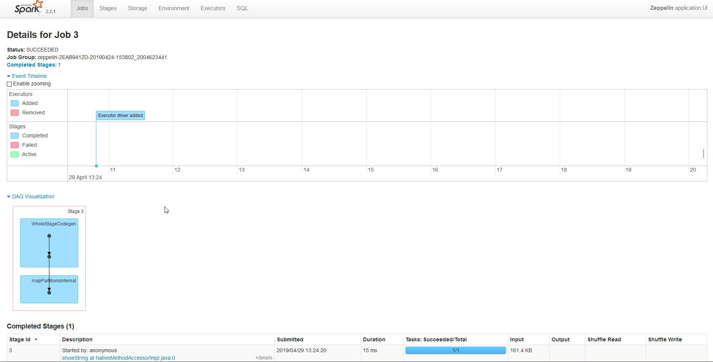
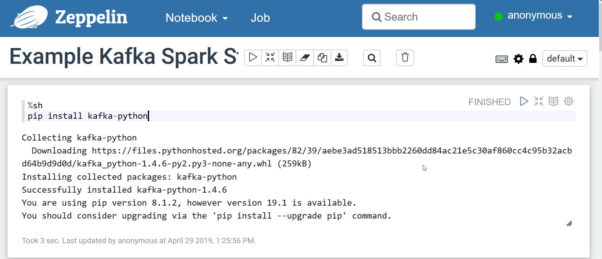
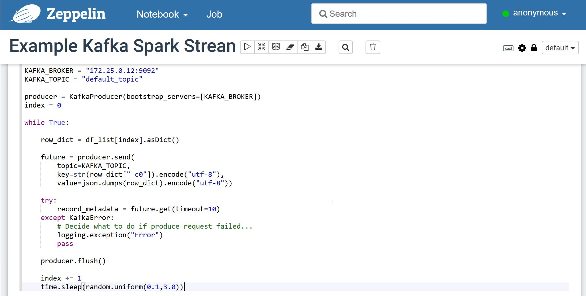
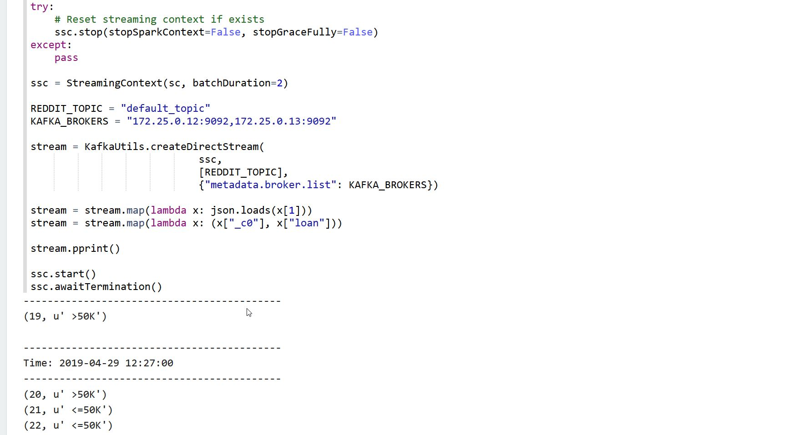

# Развертывание в один клик: Kafka Spark Streaming с пользовательским интерфейсом Zeppelin UI и мониторинг (Grafana + Kafka Manager)

Этот репозиторий содержит Docker-compose стек с Kafka и Spark Streaming, а также мониторинг с Kafka Manager и Grafana Dashboard. Сеть настроена так, что Kafka brokers  могут быть доступны с хоста.

Это также идет с примером producer-consumer, использующего небольшое подмножество [US Census adult income prediction dataset](https://www.kaggle.com/johnolafenwa/us-census-data).

## High level features:

<table>
<tr>
<td style="width: 50%">
<h2>Monitoring with grafana</h2>

</td>
<td>
<h2>Zeppelin UI</h2>

</td>
</tr>
<td style="width: 50%">
<h2>Kafka access from host</h2>

</td>
<td style="width: 50%">
<h2>Multiple spark interpreters</h2>

</td>
</table>

## Detail Summary

| Container | Image | Tag | Accessible | 
|-|-|-|-|
| zookeeper | wurstmeister/zookeeper | latest | 172.25.0.11:2181 |
| kafka1 | wurstmeister/kafka | 2.12-2.2.0 | 172.25.0.12:9092 (port 8080 for JMX metrics) |
| kafka1 | wurstmeister/kafka | 2.12-2.2.0 | 172.25.0.13:9092 (port 8080 for JMX metrics) |
| kafka_manager | hlebalbau/kafka_manager | 1.3.3.18 | 172.25.0.14:9000 |
| prometheus | prom/prometheus | v2.8.1 | 172.25.0.15:9090 |
| grafana | grafana/grafana | 6.1.1 | 172.25.0.16:3000 |
| zeppelin | apache/zeppelin | 0.8.1 | 172.25.0.19:8080 |

# Quickstart

## Running Docker Compose

Для запуска docker compose просто запустите следующую команду в текущей папке:

```
docker-compose up -d
```

Если вы хотите увидеть логи, вы можете запустить:

```
docker-compose logs -f -t --tail=10
```

Чтобы увидеть использование memory и CPU  (что удобно для того, чтобы убедиться, что у докера достаточно памяти), используйте:

```
docker stats
```

## Accessing the notebook

Вы можете получить доступ к notebook по умолчанию, перейдя по адресу http://172.25.0.19:8080/#/notebook/2EAB941ZD. 
Теперь мы можем запустить cells.

### 1) Setup

#### Install python-kafka dependency



### 2) Producer

Вы можете вызвать %producer.pyspark interpreter, который мы сможем запустить параллельно.

#### Load our example dummy dataset

We have made available a 1000-row version of the [US Census adult income prediction dataset](https://www.kaggle.com/johnolafenwa/us-census-data).


#### Start the stream of rows

Теперь мы берем одну строку случайным образом row at random и отправляем ее с помощью нашего python-kafka producer. Тема будет создана автоматически, если она не существует (учитывая, что `auto.create.topics.enable` имеет значение true).



### 3) Consumer

Вы можете использовать %consumer.pyspark, который мы сможет запустить pyspark job параллельно с producer.

#### Connect to the stream and print

Теперь мы можем запустить задание spark stream, чтобы подключиться к  topic и прослушать данные listen to dat. Job будет прослушивать окна в течение 2 секунд и напечатает ID and "label" для всех строк в этом окне



### 4) Monitor Kafka

Теперь мы можем использовать менеджер kafka manager, чтобы погрузиться в текущую настройку kafka.

#### Setup Kafka Manager

Для настройки kafka manager нам нужно его настроить. Для этого зайдите на http://172.25.0.14:9000/addCluster и заполните следующие два поля:

* Cluster name: Kafka
* Zookeeper hosts: 172.25.0.11:2181

Optionally:
* You can tick the following;
    * Enable JMX Polling
    * Poll consumer information

#### Access the topic information

Если ваш кластер был назван «Kafka», то вы можете перейти по адресу http://172.25.0.14:9000/clusters/Kafka/topics/default_topic, где вы сможете увидеть смещения раздела partition offsets. Учитывая, что тема была создана автоматически, она будет иметь только 1 partition.


#### Визуализируйте метрики в Grafana

Наконец, вы можете получить доступ к панели инструментов kafka dashboard в Grafana (имя пользователя - «admin», а пароль - «пароль»), перейдя в http://172.25.0.16:3000/d/xyAGlzgWz/kafka?orgId=1


